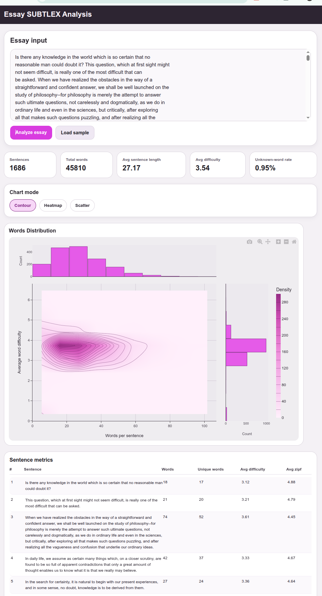

# [essay_subtrex_analysis](https://github.com/europanite/essay_subtrex_analysis "essay_subtrex_analysis")

[](https://opensource.org/licenses/Apache-2.0)

[](https://github.com/europanite/essay_subtrex_analysis/actions/workflows/ci.yml)
[](https://github.com/europanite/essay_subtrex_analysis/actions/workflows/docker.yml)
[](https://github.com/europanite/essay_subtrex_analysis/actions/workflows/deploy-pages.yml)




[PlayGround](https://europanite.github.io/essay_subtrex_analysis/)

# Essay SUBTLEX　Analysis

A web application to analyzes an English essay and visualizes each sentence.

## What it shows

- **X axis:** sentence word count
- **Y axis:** average word difficulty derived from a SUBTLEX-based frequency dictionary
- **Top histogram:** sentence word-count distribution
- **Right histogram:** sentence difficulty distribution
- **Sentence table:** per-sentence metrics including unknown-word counts

## Dictionary strategy

The app attempts to load the npm package `subtlex-word-frequencies` dynamically at runtime. A fallback mini dictionary is bundled so the UI still works during local development, tests, and cases where the package export shape differs from expectations.

`frontend/app/lib/analysis/subtlexLoader.ts` normalizes several common shapes:

- direct `{ word: score }` maps
- arrays of objects such as `{ word, zipf }`
- objects with fields like `frequency`, `count`, `fpm`, `lg10WF`, or `zipf`

## Getting started

### Local Node workflow

```bash
cd frontend/app
npm install
npm start
```

### Docker workflow

```bash
docker compose up --build
```

### Tests

```bash
docker compose -f docker-compose.test.yml up --build --exit-code-from frontend_test
```

